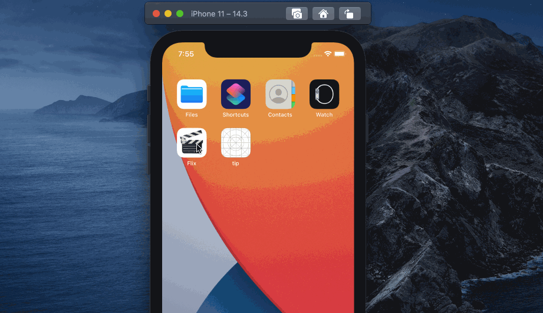
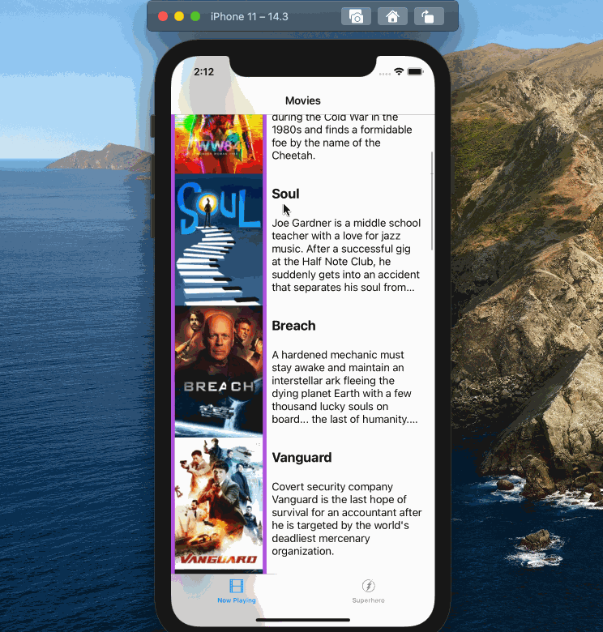

# Flix

Flix is an app that allows users to browse movies from the [The Movie Database API](http://docs.themoviedb.apiary.io/#).

---

## Flix Part 1

### User Stories

#### REQUIRED (10pts)
- [X] (2pts) User sees an app icon on the home screen and a styled launch screen.
- [X] (5pts) User can view and scroll through a list of movies now playing in theaters.
- [X] (3pts) User can view the movie poster image for each movie.

#### BONUS
- [ ] (2pt) User can view the app on various device sizes and orientations.
- [ ] (1pt) Run your app on a real device.

### App Walkthrough GIF
Here's a walkthrough of implemented user stories:

GIF created with [LiceCap](http://www.cockos.com/licecap/).

### Notes
- Installing cocoa pods was not trivial, because newer version of Xcode break the installation
- The Xcode interface has changed a bit since its updated, so the video tutorial isn't completely accurate anymore
- The set image method described in the tutorial is deprecated

---

## Flix Part 2

### User Stories

#### REQUIRED (10pts)
- [X] (5pts) User can tap a cell to see more details about a particular movie.
- [X] (5pts) User can tap a tab bar button to view a grid layout of Movie Posters using a CollectionView.

#### BONUS
- [ ] (2pts) User can tap a poster in the collection view to see a detail screen of that movie.
- [ ] (2pts) In the detail view, when the user taps the poster, a new screen is presented modally where they can view the trailer.

### App Walkthrough GIF
Here's a walkthrough of implemented user stories:

GIF created with [LiceCap](http://www.cockos.com/licecap/).

### Notes
- Took me a while to realize that the collection view settings were overwritting the cell and image view settings
