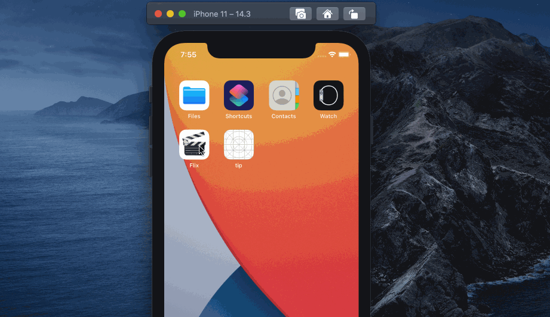

# Flix

Flix is an app that allows users to browse movies from the [The Movie Database API](http://docs.themoviedb.apiary.io/#).

📝 `NOTE - PASTE PART 2 SNIPPET HERE:` Paste the README template for part 2 of this assignment here at the top. This will show a history of your development process, which users stories you completed and how your app looked and functioned at each step.

---

## Flix Part 1

### User Stories

#### REQUIRED (10pts)
- [X] (2pts) User sees an app icon on the home screen and a styled launch screen.
- [X] (5pts) User can view and scroll through a list of movies now playing in theaters.
- [X] (3pts) User can view the movie poster image for each movie.

#### BONUS
- [ ] (2pt) User can view the app on various device sizes and orientations.
- [ ] (1pt) Run your app on a real device.

### App Walkthrough GIF
Here's a walkthrough of implemented user stories:

GIF created with [LiceCap](http://www.cockos.com/licecap/).

### Notes
- Installing cocoa pods was not trivial, because newer version of Xcode break the installation
- The Xcode interface has changed a bit since its updated, so the video tutorial isn't completely accurate anymore
- The set image method described in the tutorial is deprecated
